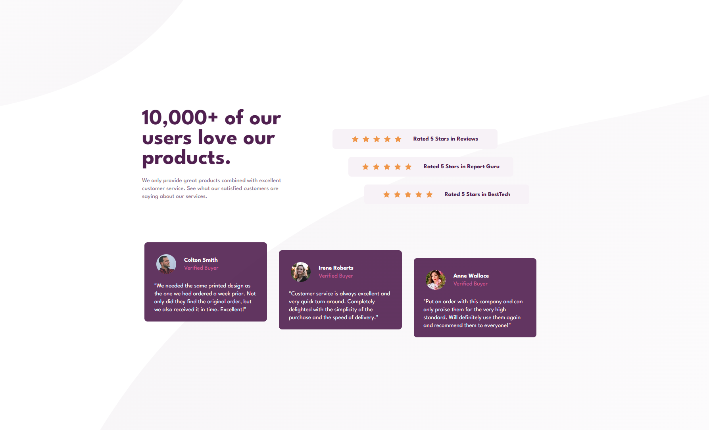
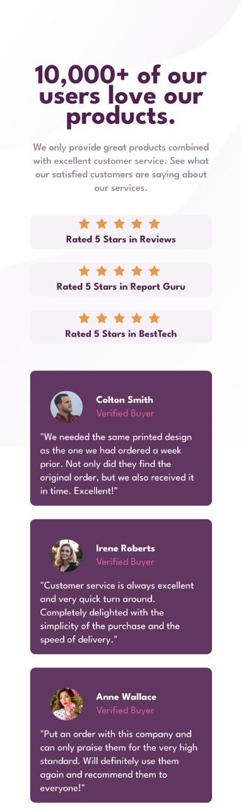

# 😶‍🌫️ Social Proof Section - Page Solution

This is my first solution to the [Social proof section challenge on Frontend Mentor](https://www.frontendmentor.io/challenges/social-proof-section-6e0qTv_bA) and took me 8 hours to complete. Frontend Mentor challenges help you improve your coding skills by building realistic projects. If you are a beginner you really need to try this!

## 🪞 Screenshots

## 🎥 Live WebSite

- [Live site URL](https://alexandru-ghergu.github.io/social-proof-section-master/)

## 🪄 Technologies

- `HTML5`
- `CSS`
- `Flexbox`

## 🎢 What I learned

- Still improving coding skills.
